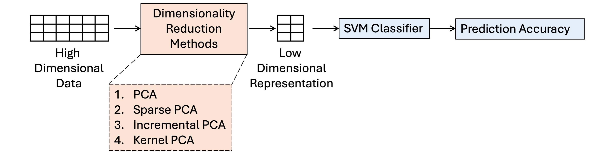
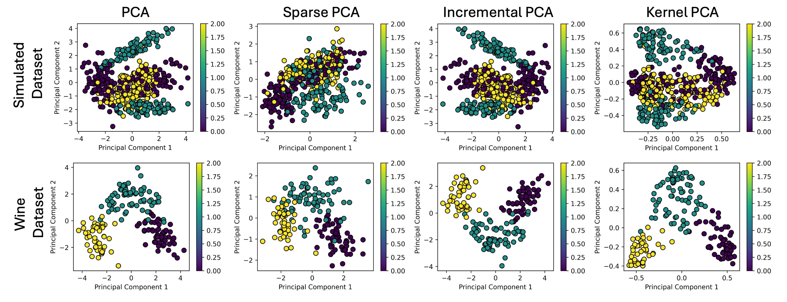
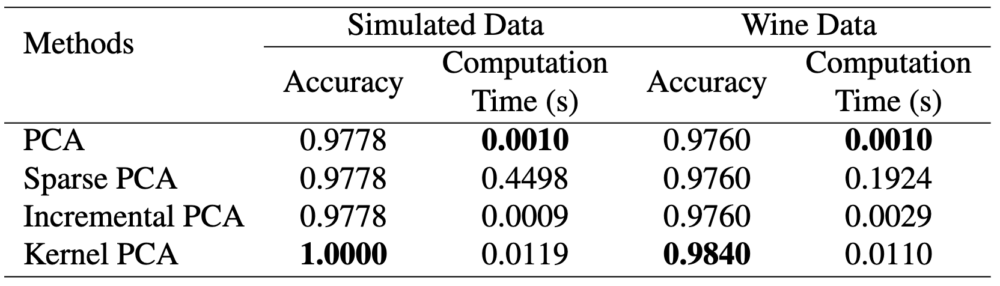

# pca_comparison
This code includes the comparison of the PCA method and its variants on simulated and real-world (wine) data.

I generated simulated data using the `sklearn` library. The `wine` data is available in the UCI ML repository. The representations of the PCA models were used as input to an SVM classifier. 

The evaluation pipeline:

Principle components for **simulated** and **wine** dataset:

Classification Results:
